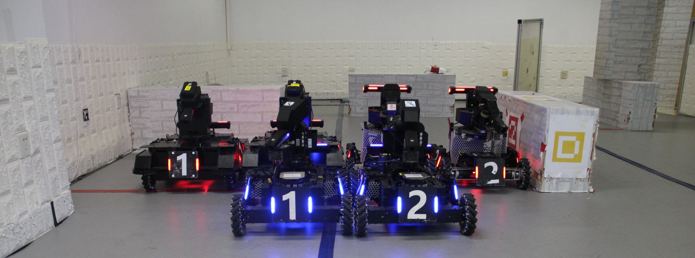
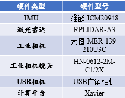
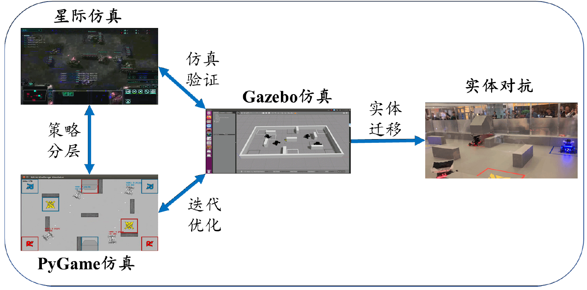
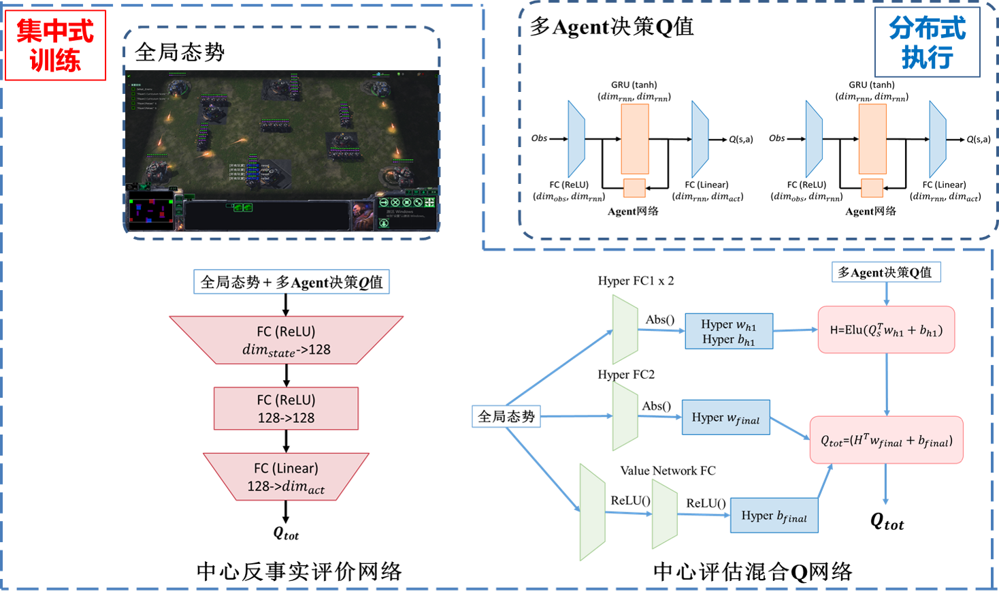
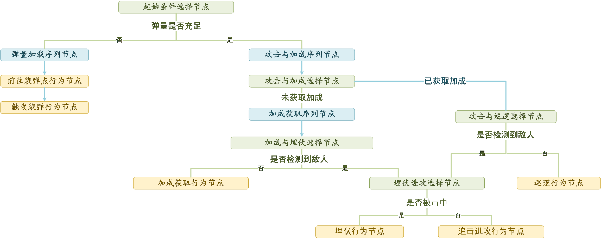
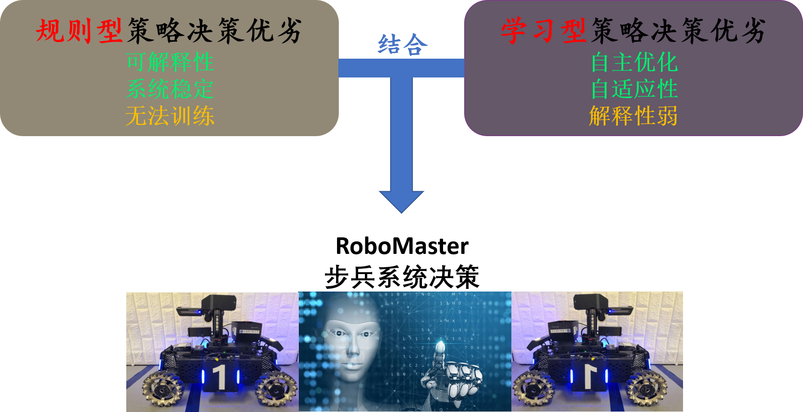

<!-- PROJECT SHIELDS -->

[![Contributors][contributors-shield]][contributors-url]
[![Forks][forks-shield]][forks-url]
[![Stargazers][stars-shield]][stars-url]
[![Issues][issues-shield]][issues-url]
[![MIT License][license-shield]][license-url]

<!-- PROJECT LOGO -->
<br />

<p align="center">
  <a href="https://github.com/DRL-CASIA/Decision/">
    
  </a>

  <h3 align="center">中国科学科院自动化研究所--Team Neurons</h3>
  <p align="center">
    Time to start！
    <!-- <br />
    <a href="https://github.com/DRL-CASIA/Decision"><strong>Wiki</strong></a>
    <br />
    <br />
    <a href="https://github.com/DRL-CASIA/Decision">查看Demo</a>
    ·
    <a href="https://github.com/DRL-CASIA/Decision/issues">报告Bug</a>
    ·
    <a href="https://github.com/DRL-CASIA/Decision/issues">提出新特性</a>
  </p> -->

</p>

## 相关工作及成果

[所内报道：深度强化学习团队提出基于深度强化学习的未知环境自主探索方法](http://www.ia.ac.cn/xwzx/kydt/202007/t20200728_5646953.html)

[公众号报道：团队新作 | 基于深度强化学习的未知环境自主探索方法](https://mp.weixin.qq.com/s/E68P5j2chxgenZOiCd0v6g)

发表文献：

 H. Li, Q. Zhang, and D. Zhao. “ Deep reinforcement learning-based automatic exploration for navigation in unknown environment,” IEEE Transactions on Neural Networks and Learning Systems, vol. 31, no. 6, pp. 2064–2076, 2020.  

&emsp;&emsp;&emsp;&emsp;&emsp;&emsp;&emsp;&emsp;&emsp;&emsp;&emsp;&emsp;&emsp;&emsp;&emsp;&emsp;&emsp;&emsp;&emsp;&emsp;&emsp;&emsp;


# 决策模块 
## 目录

- [功能介绍](#功能介绍)
- [效果展示](#效果展示)
- [配置及环境要求](#配置及环境要求)
- [编译及安装方式](#编译及安装方式)
- [软硬件系统框图](#软硬件系统框图)
- [原理介绍与理论支持分析](#原理介绍与理论支持分析)
- [软件架构与层级图](#软件架构与层级图)
- [开源协议](#开源协议)
- [设计模式](#设计模式)
- [鸣谢](#致谢)

## **功能介绍**

&emsp;&emsp;决策模块是完成RoboMaster AI Challenge任务的重要智能控制单元。其主要负责从感知层获取的原始场上信息,经过预处理后,得到敌我双方机器人状态、血量、位置等信息,并通过处理后的信息作出合适的决策行为。

<p align="center">
  <a>
    
  </a>
  <h3 align="center">RM AI机器人</h3> 
</p>

&emsp;&emsp;在感知系统完成的基础上，决策组的工作重点集中在决策层系统部署以及仿真训练环境搭建。针对RoboMaster AI Challenge中典型的2v2自主机器人对战方式，我们将2v2对战视为零和博弈问题，并使用**多智能体深度强化学习**和**行为决策树**两种方式设计决策器。同时，为了结合规则型决策和学习型决策两种方式的优劣，并将大量的环境交互数据网络优化的结果运用于实车决策，我们构造了三种仿真环境实现对算法的验证开发。分别是用于模型验证的**Gazebo环境**，策略训练的**星际环境**以及端到端控制训练的**PyGame环境**。

---


## **效果展示** 
### **仿真平台场景**
<div align="center">
<center class="half">
    <h3 align="center">星际平台仿真 &emsp;&emsp;&emsp;&emsp;&emsp;&emsp; &emsp;&emsp;&emsp;&emsp;&emsp;&emsp; Pygame平台仿真</h3> 
     &emsp;
</center>
&emsp;&emsp;&emsp;&emsp;&emsp;&emsp;&emsp;&emsp;&emsp;&emsp;&emsp;&emsp;&emsp;&emsp;&emsp;&emsp;&emsp;&emsp;&emsp;&emsp;&emsp;&emsp;&emsp;&emsp;
<h3 align="center">Gazebo平台仿真 &emsp;&emsp;&emsp;&emsp;&emsp;&emsp; &emsp;&emsp;&emsp;&emsp;&emsp;&emsp; Stage平台仿真</h3> 
<center class="half">
     &emsp;
</center>
</div>

&emsp;&emsp;&emsp;&emsp;&emsp;&emsp;&emsp;&emsp;&emsp;&emsp;&emsp;&emsp;&emsp;&emsp;&emsp;&emsp;&emsp;&emsp;&emsp;&emsp;&emsp;&emsp;&emsp;&emsp;

### **实车场景**
<div align="center">
<center class="half">
    <h3 align="center">双车巡航场景 &emsp;&emsp;&emsp;&emsp;&emsp;&emsp; &emsp;&emsp;&emsp;&emsp;&emsp;&emsp; 追踪敌车场景</h3> 
     &emsp;
</center>
&emsp;&emsp;&emsp;&emsp;&emsp;&emsp;&emsp;&emsp;&emsp;&emsp;&emsp;&emsp;&emsp;&emsp;&emsp;&emsp;&emsp;&emsp;&emsp;&emsp;&emsp;&emsp;&emsp;&emsp;&emsp;&emsp;&emsp;&emsp;&emsp;

<h3 align="center">1vs1对抗场景 &emsp;&emsp;&emsp;&emsp;&emsp;&emsp; &emsp;&emsp;&emsp;&emsp;&emsp;&emsp; 1vs2对抗场景</h3> 
<center class="half">
     &emsp;
</center>
</div>

&emsp;&emsp;&emsp;&emsp;&emsp;&emsp;&emsp;&emsp;&emsp;&emsp;&emsp;&emsp;&emsp;&emsp;&emsp;&emsp;&emsp;&emsp;&emsp;&emsp;&emsp;&emsp;&emsp;&emsp;&emsp;&emsp;&emsp;&emsp;&emsp;&emsp;&emsp;
<p align="center">
  <a>
    
  </a>
  <h3 align="center">2对2终极对打</h3>  
</p>
&emsp;&emsp;&emsp;&emsp;&emsp;&emsp;&emsp;&emsp;&emsp;&emsp;&emsp;&emsp;&emsp;&emsp;&emsp;&emsp;&emsp;&emsp;&emsp;&emsp;&emsp;&emsp;

## **配置及环境要求**
### **操作系统配置**
所有RM机器人均配备NVIDIA JETSON XAVIER嵌入式高性能计算单元作为车载电脑。
- CPU框架：ARMv8
- GPU计算能力：32TFLOPS
- 操作系统：JETPACK 4.2.2 (ARM框架下Ubuntu18.04以及GPU所需的软件包)
### **软件环境要求**
- Ubuntu 18.04 / 16.04
- CUDA 10.0 + cuDNN 7.3.1
- TensorRT 5.0.3
- OpenCV 3.3.1
- Pytorch c++ 1.1.0 + Torchvision 0.3.0
- [ROS Kinetic(Ubuntu 16.04)及其依赖包](https://robomaster.github.io/RoboRTS-Tutorial/#/quick_start/setup_on_manifold2)

## **编译/安装/运行方式**
### **配置及安装Pytorch C++**
为了提升决策模块在实体步兵机器人上的实时性能，学习型策略得到的模型需要在pytorch c++环境中部署，因此需要在车载计算单元上手动编译安装pytorch。

```
# 新建工作空间
mkdir robo_ws
cd robo_ws

# 复制pytorch源码到本地并进入，需要指定pytorch依赖库
git clone -b v1.1.0 https://github.com/pytorch/pytorch.git
cd pytorch 

# 更新依赖模块
git submodule sync
git submodule update --init --recursive

# 更改CMakeLists.txt中的以下参数，决定安装的模块
BUILD_TORCH -> ON
BUILD_BINARY -> ON
BUILD_PYTHON -> OFF

# 编译文件
mkdir build 
cd build
cmake ..
make -j8
sudo make install
```

### **编译决策模块**

```
# 复制本项目到本地
git clone git@github.com:DRL-CASIA/Decision.git

# 进入仓库文件夹
cd Decision/

# 将roborts_decision包拷贝至Roborts原代码目录
cp -r roborts_decision/. robo_ws/src

# 进入Roborts主目录
cd robo_ws

# 完全编译
catkin_make

# 也可对package进行单独编译
catkin_make --pkg roborts_decision -j8

# 如果遇到protobuf和pytorch相关问题，需要到pytorch官网或其Github下载并解压libtorch包(v1.1.0)，将libtorch中的文件放在pytorch文件夹中即可。
unzip -cftu libtorch.zip -d libtorch
mv -r ./libtorch ./pytorch
```

### **运行编译完成模块指令**
```
## 单车决策测试------
# 运行启动节点
roslaunch roborts_bringup roborts.launch

# 运行决策节点
rosrun roborts_decision decision_node

## 双车决策测试------
# 运行所有启动节点
roslaunch roborts_bringup multi_stage.launch

```
### **文件目录说明**


```
roborts_decision
├── behavior_tree                   #决策行为树
│   ├── behavior_node.h             #行为树节点类定义
│   ├── behavior_state.h            #行为树状态定义
│   └── behavior_tree.h             #行为树运行类定义
├── blackboard
│   ├── blackboard.h                #黑板定义（决策框架的输入）
│   └── communication.h             #通信定义（用于友军间通讯）
├── blue_master.cpp
├── blue_wing.cpp
├── cmake-build-debug
├── CMakeLists.txt
├── cmake_module                     
├── config                          #四辆车单独配置文件
│   ├── blue_master.prototxt
│   ├── blue_wing.prototxt
│   ├── decision.prototxt
│   ├── red_master.prototxt
│   └── red_wing.prototxt
├── decision_node.cpp
├── example_behavior                 #行为模板
│   ├── ambush_behavior.h            #埋伏，站桩输出
│   ├── attack_behavior.h            #支援，前往攻击
│   ├── back_boot_area_behavior.h    #返回基地
│   ├── chase_behavior.h             #追击
│   ├── escape_behavior.h            #撤退
│   ├── goal_behavior.h              #指定目标导航
│   ├── nn_behavior.h                #神经网络决策
│   ├── line_iterator.h              #直线路径判断迭代器
│   ├── patrol_behavior.h            #内环巡逻
│   ├── reload_behavior.h            #外环巡逻
│   ├── search_behavior.h            #在敌方消失区域进行搜索
│   ├── shield_behavior.h            #前往装甲buff区
│   └── test_behavior.h              #测试，用于新功能开发
├── executor
│   ├── chassis_executor.cpp
│   ├── chassis_executor.h           #底盘任务调度类定义
│   ├── gimbal_executor.cpp
│   └── gimbal_executor.h            #任务调度类定义
├── package.xml
├── proto
│   ├── decision.pb.cc
│   ├── decision.pb.h
│   └── decision.proto               #策略层参数配置
├── red_master.cpp
├── red_wing.cpp
└── sel_behavior_node.cpp
```


---
## **系统框图**
### **硬件部分**

&emsp;&emsp;步兵机器人的硬件系统除了自带的底盘和云盘系统以外，为了实现机器人的定位，检测和自主移动等功能，需要在机器人主题上加装各种外围传感器。在传感器选型时需要注意传感器的尺寸，重量，合适的安装位置，开发难度等。在当前版本的机器人系统中，我们配备了工业相机，激光雷达，后置USB相机，为步兵机器人提供合理有效的视野范围。传感器选型及硬件部署如下：
<div align="center">
<center class="half">
 <h3 align="center">传感器型号 &emsp;&emsp;&emsp;&emsp;&emsp;&emsp; &emsp;&emsp;&emsp;&emsp;&emsp;&emsp; 传感器部署图</h3> 
     &emsp;&emsp;
</center>
</div> 
&emsp;&emsp;&emsp;&emsp;&emsp;&emsp;&emsp;&emsp;&emsp;&emsp;&emsp;&emsp;&emsp;&emsp;&emsp;&emsp;&emsp;&emsp;&emsp;&emsp;&emsp;&emsp;

<!-- <p align="center">
  <a>
    
  </a>
  <h3 align="center">硬件系统框图</h3>  
</p>

<p align="center">
  <a>
    
  </a>
  <h3 align="center">传感器部署图</h3>  
</p> -->


### **软件部分**

&emsp;&emsp;整车的软件架构如下图所示,决策模块接受底层驱动/感知/规划/控制层信息,通过规则型（决策树）和学习型（多智能体深度强化学习）两种策略方式决定步兵机器人下一步动作。除决策系统部署外，决策组还承担仿真训练环境的搭建任务。
<p align="center">
  <a>
    
  </a>
  <h3 align="center">软件系统框图</h3>  
</p>

### **仿真平台部分**
&emsp;&emsp;对于学习型决策算法，通常需要大量的数据资源作为训练基础，同时需要反复迭代优化神经网络性能，因此需要构建仿真模拟器实现复杂的对抗场景，并基于复现场景优化决策模块。同时，在实车测试之前，决策系统的输出结果需要在仿真系统中进行测试并验证。我们构造了三种仿真环境以满足不同的实验需求，分别是用于模型验证的Gazebo环境，策略训练的星际环境以及端到端控制训练的PyGame环境。仿真平台及关系如下图所示。
<p align="center">
  <a>
    
  </a>
  <h3 align="center">仿真平台系统框图</h3>  
</p>

---
## **原理介绍与理论支持分析**

### **多智能体深度强化学习**
&emsp;&emsp;学习型策略采用多智能体深度强化学习方法。采取与系统内置AI作战的对抗训练方式，经过混合迭代中心反事实评估网络和中心评估混合Q网络方法，对全局态势进行估计，根据胜负奖赏与血量差等奖赏信号，优化多智能体网络，优化策略决策，使策略系统自适应RoboMaster对抗环境。
<p align="center">
  <a>
    
  </a>
  <h3 align="center">多智能体神经网路策略优化图
</h3>  
</p>

### **行为决策树**
&emsp;&emsp;行为树作为典型的规则型决策算法，已在游戏领域得到广泛应用。这里我们通过定义选择节点、序列节点、并行节点和行为节点来实现追踪、射击、补弹、占领buff等作战决策行为。决策逻辑如下：
<p align="center">
  <a>
    
  </a>
  <h3 align="center">决策树逻辑
</h3>  
</p>

---
## **软件架构与层级图**


### **决策任务**

&emsp;&emsp;总体而言，规则型决策具有系统可解释性且表现性能较为稳定，但无法作自学习持续优化完善；学习型决策具有自主进化的能力，可自适应系统环境，但一般需要较长的训练优化时间和较多的计算资源，缺乏可解释性且稳定性较弱。为了将规则型和学习型算法有机结合，我们通过学习型算法使机器人在RoboMaster对抗环境下作探索，并与系统内置脚本AI作对抗，找到有效攻击策略。然后通过规则组合的方式，使机器人作出近似决策行为，完善决策系统功能。这样既增强系统的可解释性和稳定性，并强化了多机器人协作表现性能。


<p align="center">
  <a>
    
  </a>
  <h3 align="center">决策树逻辑
</h3>  
</p>

---
## **开源协议**

该项目签署了MIT 授权许可，详情请参阅 [LICENSE.txt](https://github.com/DRL-CASIA/Decision/blob/master/LICENSE.txt)


---
## **致谢**


 - [deepmind/pysc2 ](https://github.com/deepmind/pysc2)
- [StarCraft Multi-Agent Challenge (SMAC)](https://github.com/oxwhirl/smac)
- [RoboMaster-AI-Challenge-Simulator-2D](https://github.com/LoveThinkinghard/RoboMaster-AI-Challenge-Simulator-2D)
- [ICRA2018_DJI_RM_AI_Challenge_NJUST](https://github.com/jackychen227/ICRA2018_DJI_RM_AI_Challenge_NJUST)

&emsp;&emsp;感谢上述项目的开源作者，提供的宝贵方法及经验，推动并促进相关社区的研究发展。感谢RoboMaster AI挑战赛队员们的坚持及付出，在大家的共同努力下，顺利完成本项任务。最后，由衷感谢大疆RoboMaster组委会的辛勤组织及付出，尽最大努力筹办本项赛事，为2020赛季画下一个令人难忘的句点。


<!-- links -->
[your-project-path]:DRL-CASIA/Decision
[contributors-shield]: https://img.shields.io/github/contributors/DRL-CASIA/Decision.svg?style=flat-square
[contributors-url]: https://github.com/DRL-CASIA/Decision/graphs/contributors
[forks-shield]: https://img.shields.io/github/forks/DRL-CASIA/Decision.svg?style=flat-square
[forks-url]: https://github.com/DRL-CASIA/Decision/network/members
[stars-shield]: https://img.shields.io/github/stars/DRL-CASIA/Decision.svg?style=flat-square
[stars-url]: https://github.com/DRL-CASIA/Decision/stargazers
[issues-shield]: https://img.shields.io/github/issues/DRL-CASIA/Decision.svg?style=flat-square
[issues-url]: https://img.shields.io/github/issues/DRL-CASIA/Decision.svg
[license-shield]: https://img.shields.io/github/license/DRL-CASIA/Decision.svg?style=flat-square
[license-url]: https://github.com/DRL-CASIA/Decision/blob/master/LICENSE
[linkedin-shield]: https://img.shields.io/badge/-LinkedIn-black.svg?style=flat-square&logo=linkedin&colorB=555
[linkedin-url]: https://linkedin.com/in/zhentaotang


